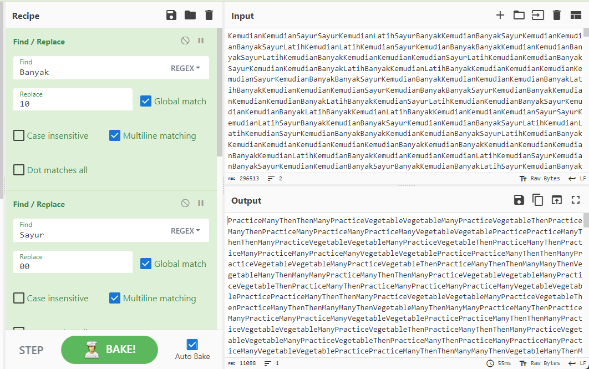
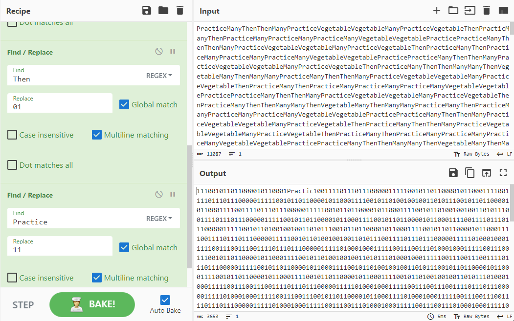
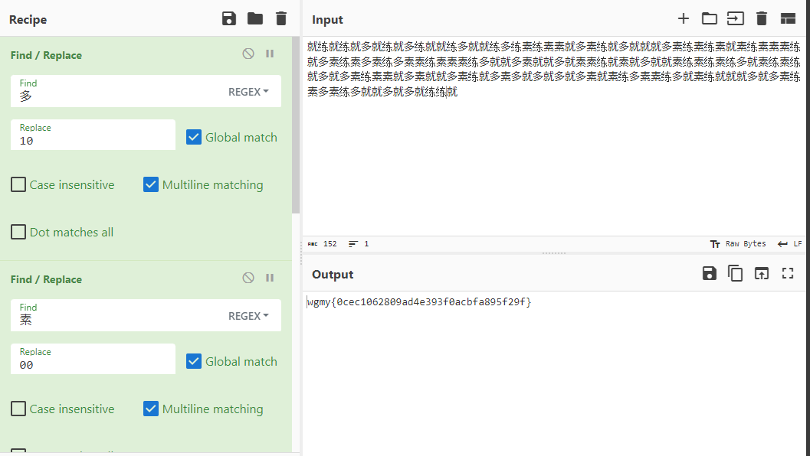

# Sayur
> Sayur Kemudian Lebih Latih

## Solution
For this challenge, we are given a zip file contains <a href="/images/sayur.png">sayur.png</a>. The picture itself didnt seem interesting so I immediately thought of steganography. I tried several tools such as ```steghide```, ```binwalk``` and ```exiftool``` but nothing interesting. Then, I used ```zsteg``` and I found a text string that repeating certain words which are ```Kemudian```, ```Sayur```, ```Banyak```, ```Latih```. The sequence of the words seems random at first and not following the description of the challenge. But when analyzed further, it can be interpreted as binary digits.

Since we have 4 words, we can deduce that the bits for each word would be either ```00```, ```01```, ```10``` or ```11```. But the question is, how to determine which bits for each words? 

The hint is actually this challenge description.

```
Sayur: 00
Kemudian: 01
Banyak: 10
Latih: 11
```
By using Cyberchef Find and Replace feature, we can decode the text strings as a binary strings which then can be translated into a new text strings. The new text strings contain words such as ```Then```, ```Vegetable```, ```Practice``` and ```Many```. 

<p align="center">
  
</p>

Just repeat the previous method and we can get another binary strings.
```
Vegetable: 00
Then: 01
Many: 10
Practice: 11
```


<p align="center">
  
</p>

At this stage, Cyberchef cant decode the binary strings automatically into readable text. So, maybe the characters are not English alphabets. From the original image, we can see a picture of a man with Chinese subtitles at the bottom of image. 

But wait, there are also 4 Chinese characters on the subtitle. So, I tried using Google Lens to translate the characters and suprisingly, the characters translate into ```Vegetable```,```Then```,```Many``` and ```Practice```.
<p align="center">
  
</p>

```
素 (vegetable): 00
就 (then): 01
多 (many): 10
练 (practice): 11
```
<p align="center">
  
</p>

## Flag
The flag for this challenge is ```wgmy{0cec1062809ad4e393f0acbfa895f29f}```
